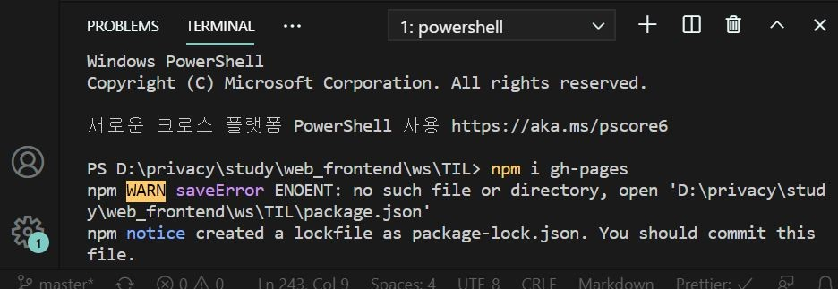

# ReactJS로 웹 서비스 만들기

## #4 MAKING THE MOVIE APP

### #4.2 Styling the Movies

### 1. App 컴포넌트에 html추가하기

```
import React from "react";
import axios from "axios";
import Movie from "./Movie";

class App extends React.Component {
  state = {
    isLoading: true,
    movies: [],
  };
  // 6초 뒤에 we are ready반환
  getMovies = async () => {
    const {
      data: {
        data: { movies },
      },
    } = await axios.get(
      "http://yts-proxy.now.sh/list_movies.json?sort_by=rating"
    );
    this.setState({ movies, isLoading: false });
  };

  componentDidMount() {
    this.getMovies();
  }

  render() {
    const { isLoading, movies } = this.state;
    return (
      <section class="container">
        {isLoading ? (
          <div class="loader">
            <span class="loader__text">Loading...</span>
          </div>
        ) : (
          <div class="movies">
            {movies.map((movie) => {
              return (
                <Movie
                  key={movie.id}
                  id={movie.id}
                  year={movie.year}
                  title={movie.title}
                  summary={movie.summary}
                  poster={movie.medium_cover_image}
                />
              );
            })}
          </div>
        )}
      </section>
    );
  }
}

export default App;
```

### 2. Movie컴포넌트에 html추가하기

```
import React from "react";
import PropTypes from "prop-types";

function Movie({ year, title, summary, poster }) {
  return (
    <div class="movie">
    <!-- 영화 이미지 추가하기 -->
      
      <h3 class="movie__title" style={{ backgroundColor: "Red" }}>
        {title}
      </h3>

      <h5 class="movie__year">{year}</h5>
      <p class="movie__summary">{summary}</p>
    </div>
  );
}

Movie.propTypes = {
  year: PropTypes.number.isRequired,
  title: PropTypes.string.isRequired,
  summary: PropTypes.string.isRequired,
  poster: PropTypes.string.isRequired,
};

export default Movie;
```

### 4.3 Adding Genres

### 1. 노마드코더 영화API에서 장르 키 살펴보자

https://yts.mx/api/v2/list_movies.json?sort_by=rating에서 genres키 찾아서 다음과 같이 movie컴포넌트에 genres props를 넘겨주었다.

```movie.js
function Movie({ title, year, summary, poster, genres }) {
  return (
    <div class="movie">
      
      <div class="movie__data">
        <h3 class="movie__title">{title}</h3>
        <h5 class="movie__year">{year}</h5>
        <ul class="movie__genres">
          {genres.map((genre, index) => {
            return (
              <li key={index} class="movie__genre">
                {genre}
              </li>
            );
          })}
        </ul>
        <p class="movie__summary">{summary}</p>
      </div>
    </div>
  );
}

Movie.propTypes = {
  year: PropTypes.number.isRequired,
  title: PropTypes.string.isRequired,
  summary: PropTypes.string.isRequired,
  poster: PropTypes.string.isRequired,
  genres: PropTypes.arrayOf(PropTypes.string).isRequired,
};

export default Movie;
```

실행시 console탭에서 경고 메세지 2개가 뜨게 된다.

- jsx에 사용한 속성 중 class속성이 className으로 사용되어야 한다는 경고
- genres props가 필수(required)인데 Movie컴포넌트에 undefined로 넘어왔다는 경고

### 2. App 컴포넌트 수정하기

우선 genres가 undefined인 상태를 고쳐보자.App 컴포넌트에서 Movie컴포넌트로 genres props를 전달하면 된다.

```app.js
  render() {
    const { isLoading, movies } = this.state;
    return (
      <section class="container">
        {isLoading ? (
          <div class="loader">
            <span class="loader__text">Loading...</span>
          </div>
        ) : (
          <div class="movies">
            {movies.map((movie) => {
              return (
                <Movie
                  (생략...)
                  genres={movie.genres}
                />
              );
            })}
          </div>
        )}
      </section>
    );
  }
}

export default App;
```

### 3. class 속성이름 className으로 바꿔주기

App.js, Movie.js순서대로 class 속성이름 className으로 바꿔주자.

### 4. 영화장르 출력하기

이제 Movie 컴포넌트에서 장르를 출력하도록 코드를 수정해보자.
genres props가 배열이므로 map()함수를 사용할 것이다. genres props를 ul, li엘리먼트로 감싸 출력해보자.

```Movie.js
function Movie({ title, year, summary, poster, genres }) {
  return (
    <div className="movie">
      
      <div className="movie__data">
        <h3 className="movie__title">{title}</h3>
        <h5 className="movie__year">{year}</h5>
        <ul className="movie__genres">
          {genres.map((genre) => {
            return (
              <li className="movie__genre">
                {genre}
              </li>
            );
          })}
        </ul>
        <p className="movie__summary">{summary}</p>
      </div>
    </div>
  );
}
```

그런데 console탭을 보면 경고 메세지가 뜨게 되는데, 장르를 출력할 때 사용한 li엘리먼트에 key props를 추가하지 않아서 그런 것이다. 이런 경우에는 map()함수의 2번째 인자를 전달하면 된다.

### 5. li엘리먼트에 key porps 추가하기

보통 map()함수의 2번째 인자이름은 index라고 지어주므로 다음과 같이 코드를 작성하자.

```Movie.js
function Movie({ title, year, summary, poster, genres }) {
  return (
    <div className="movie">
      
      <div className="movie__data">
        <h3 className="movie__title">{title}</h3>
        <h5 className="movie__year">{year}</h5>
        <ul className="movie__genres">
        <!-- index추가 -->
          {genres.map((genre, index) => {
            return (
              <li key={index} className="movie__genre">
                {genre}
              </li>
            );
          })}
        </ul>
        <p className="movie__summary">{summary}</p>
      </div>
    </div>
  );
}
```

## #5 CONCLUSIONS

### #5.0 deploying to Github Pages



Terminal
