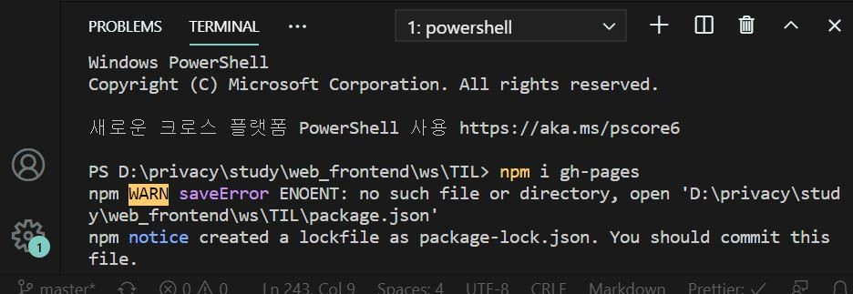

## 5 CONCLUSIONS

### 5.0 deploying to Github Pages

### (1) Terminal에서 npm remote -v 한 후에 npm i gh-pages설치한다.

(gh-pages는 나의 웹사이트를 github의 github page 도메인에 나타나게 해준다.)

### (2) package.json으로 가서 다음과 같이 homepage추가한다.

내 홈페이지 주소 입력하는 순서 : https://{your github username}.github.io/{the name of your project in github}

### (3)다음과 같이 deploy,predeloy추가한다.

### (4)terminal에서 npm run build -> npm i gh-pages -> npm run deploy 순서대로 실행한다.

### (5) 내홈페이지 주소로 들어가서 정상실행되는지 확인한다.

https://kjhabc2002.github.io/movie_app_2020/ ->정상실행 확인

# Java (Java Programming Language)

## 1.자바란?

자바는 썬 마이크로 시스템즈(Sun Microsystems, Inc. 이하 썬)에서 개발하여 1995년 1월에 공식적으로 발표한 객체지향 프로그래밍 언어이다.

## 2.자바언어의 특징
