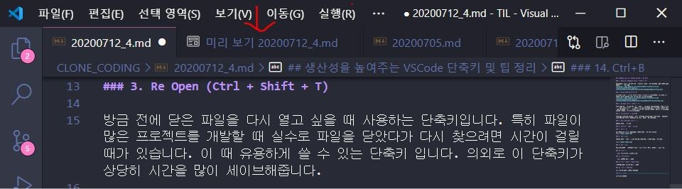
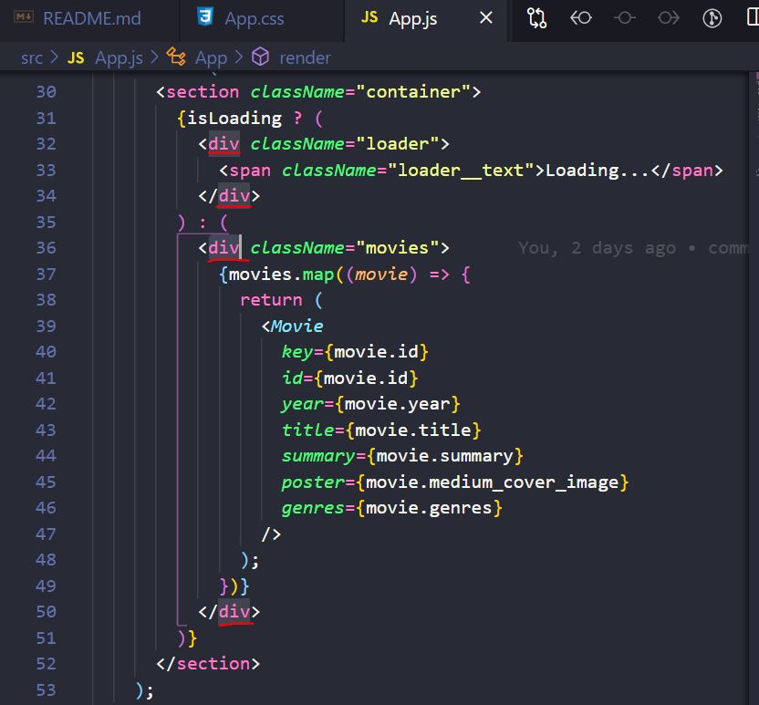
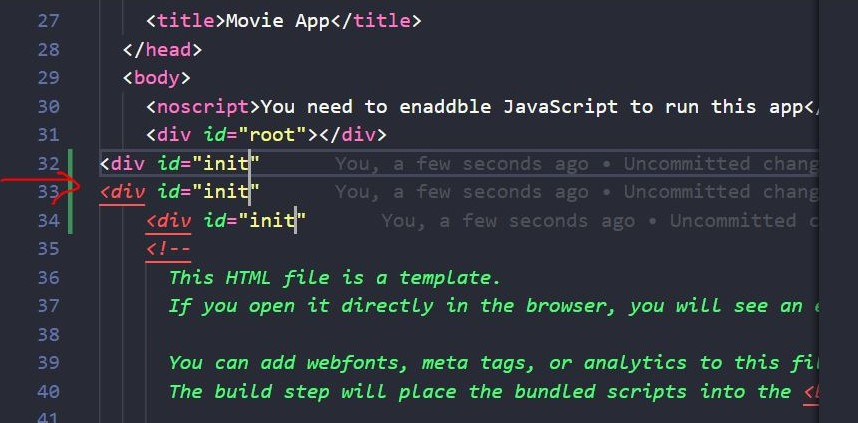

## 생산성을 높여주는 VSCode 단축키 및 팁 정리

### 1. Show All Commands (Ctrl + Shift + P)

VSCode에서 사용할 수 있는 모든 명령어를 입력할 수 있습니다. 가장 기초 중의 기초라고 할 수 있죠.

### 2. Quick Open(Ctrl+P or E)

파일명을 찾을 때 일일이 폴더를 열면서 찾으면 한 세월입니다. 파일명을 알고 있다면 Quick Open을 통해 파일을 바로 열 수 있습니다.

### 3. Re Open (Ctrl + Shift + T)

방금 전에 닫은 파일을 다시 열고 싶을 때 사용하는 단축키입니다. 특히 파일이 많은 프로젝트를 개발할 때 실수로 파일을 닫았다가 다시 찾으려면 시간이 걸릴 때가 있습니다. 이 때 유용하게 쓸 수 있는 단축키 입니다. 의외로 이 단축키가 상당히 시간을 많이 세이브해줍니다.

### 4. Ctrl+Shift+v : 미리보기

깃허브에 commit후 push하고 나서 사이트에 직접들어가서 결과확인할 필요없이 미리보기창을 열어서 수정하는 그때그때 확인할 수 있습니다.

### 5. User Settings (Ctrl + ,)

설정을 확인, 변경한다.

### 6. Alt+1~9 : 탭을 선택한다.

### 7. Ctrl + D

자주반복되는 코드를 가져다가 한번에 수정할 수 있는 단축키

### 8. Alt+ click

옵션을 누르고 클릭할때마다 커서가 생기는데, 한방에 편집할 수 있다.

### 9. Alt + ↑/↓

복사,붙여넣기 할 필요없이 해당 선택된 코드를 위로, 아래로 움직여준다.

### 10. Ctrl + /

선택된 코드블록을 주석처리한다.

### 11. Alt+shift+i

선택된 영역에 커서 만들기

### 12. Alt + Shift + Mouse Drag

마우스가 가는 곳마다 커서 만들기

### 13. Ctrl + Home/End

파일 맨 위-아래 한번에 이동하기

### 14. Ctrl+B

사이드바 숨기기
