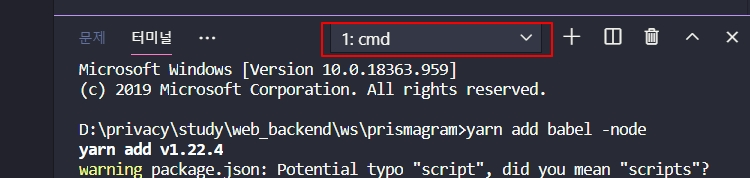
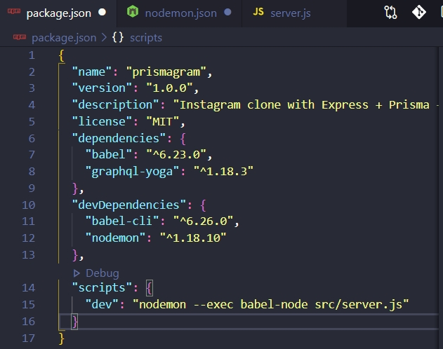

# [풀스택]인스타그램 클론 코딩

## 1.0 Setting up the project

### vsc 터미널에서 명령어 실행

yarn add nodemon -D  
yarn add babel-node  
yarn add babel-cli -D

터미널에 명령어 입력하는 부분에서 yarn 실행이 안될시,
빨간색블록 클릭 후 기본셀선택 -> cmd 입력하고나서 터미널 재시작하면 명령어 정상실행된다.

babel은 멋진코드를 못생긴 코드로 바꿔주는 도구이다.  
nodemon을 실행할 때마다 babel-node로 src폴더의 server.js파일을 실행하게된다. nodemon은 파일을 저장할때마다 실행을 새로 해주는 도구이다. 서버를 껐다가 켤 필요가 없다.

## 1.1 Creating GraphQL Server

### yarn add dotenv 명령어 실행
dotenv 모듈은 .env 파일을 읽는다.

### 개발환경 설정하는 과정에서 오류가 발생하는데 영상 아래 사람들의 댓글을 참고하여 해결해보자.

## GraphQL 소개

GraphQL은 API를 위한 쿼리 언어이며 타입 시스템을 사용하여 쿼리를 실행하는 서버사이드 런타임입니다. GraphQL은 특정한 데이터베이스나 특정한 스토리지 엔진과 관계되어 있지 않으며 기존 코드와 데이터에 의해 대체됩니다.
