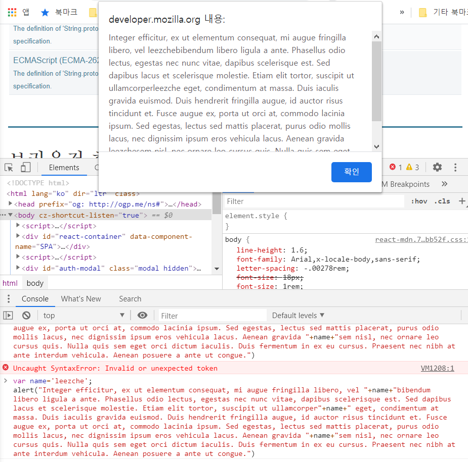

# JavaScript

html과 css는 정적인 언어입니다. 정적이라는 것은 이것들이 브라우저를 통해서 웹페이지를 화면에 그려주면 이 화면을 변경할 수 있는 방법이 없다는 의미입니다.

- 정적인 웹페이지? 서버에 미리 저장된파일(html,image,javascript파일 등)이 그대로 전달되는 웹페이지 , 한번화면에 출력되면 그모습 그대로 유지하는 페이지

자바스크립트는 html과 css로 만들어진 웹페이지를 동적으로 변경해주는 언어입니다.

jQuery : 자바스크립트 라이브러리입니다. 라이브러리란 자주 사용하는 기능들을 모아두었다가 필요할 때 그냥 가져다 쓸 수 있도록한것들의 묶음 , jquery는 자바스크립트의 생산성을 극적으로 향상시켜주는 기술입니다.

## 1. 수업의 목적

### 1.1 HTML과 JavaScript의 만남1 (script 태그)

javascript를 쓴다고 알리는 것이 script태그이고, 자바스크립트는 동적인 언어이다 (1+1)가 2가 나온다.

### 1.2 HTML과 JavaScript의 만남2 (이벤트)

사건을 통해 사용자가 상호작용 가능한 웹을 만들 수 있다.  
자주 사용하는 event에는 10~20개 정도가 있는데 on click/on change/ on keydown 등이 있다.

### 1.3 HTML과 JavaScript의 만남3 (콘솔)

javascript는 script 태그를 이용하거나, 특정사건 event에 대해서 on ~ attribute를 추가해서 실행하거나, console에서 웹페이지에 실행시키는 용도로 사용할 수 있다.

## 2. 데이터타입

### 2.1 문자열과 숫자

1. 웹브라우저에 개발자 도구를 열고 테스트

2. 'javascript data type'검색

- 'javascript data type'검색 : 다양한 글을 통해 자신이 원하는 js문법을 찾아서 활용
- number 숫자 , string 문자
- 문자의 경우 '작은따옴표' 또는 "큰따옴표"로 표시
- 산술연산자 : +,-,\*,/

3. 숫자와 글자 입력 결과값 비교하기

### 2.2 데이터타입 -변수와 대입 연산자

변수는 데이터를 담는 그릇으로, alert('name')이라기보단 var 'name';으로 선언해주는 것이 좋다.  
name이라는 문자를 변수로 선언하여 아래 글귀에 대입을 하게 되면 위에 모달창에서와 같이 데이터가 나오게 된다.

- 연산자모음  
  

### 3. 웹브라우저 제어

div : 무색무취의 아무런 기능이 없는 태그,줄바꿈됨
span : 줄바꿈이 되지 않는 무색무취의 태그

자바스크립을 이용해서 제어하고자하는 태그를 통해 스타일을 줄 수 있다.

### 4. 제어할 태그 선택하기

document.querySelector('selector');

위 방식을 사용하여 괄호안에 원하는 선택자를 입력한다.

그외 검색을 통해 예제 참고

1. google에 javascript select tag by css selector 검색 후 예제참고
2. javascript element style검색 후 아무 페이지 들어가서 예제참고
3. javascript background color 검색 후 예제참고

### 5. 비교 연산자와 블리언

좌항과 우항을 비교해서 true or false값을 나타내는 것이 비교연산자이고,
true와 false 두개를 가르켜서 불리언이라고 한다.

### 6. 조건문의 활용

javascript element get value 검색하여 콘솔창에 입력

### 7. 리팩토링(refactoring)

우리가 코딩을 하고나면 코드가 좀 비효율적이게 생기기 마련인데 동작하는 것을 그대로 두고 코드자체를 아주 효율적으로 만들어서 그 코드의 가독성을 높이고 유지보수를 하기 편리하게 만들고 중복된 코드를 낮추고 ..등등 이러한 방향으로 코드를 개선하는 것이 리팩토링이라고 한다.

1. this연산자 사용
2. var 변수선언하여 document.querySelector('body')대신 변수입력

### 8. 배열

[배열예제](https://github.com/kjhabc2002/TIL/blob/master/javascript/Exam2020/ex6.html)

1. var cowokers=["egoing","leezche"]; 배열정의
2. document.write(cowokers[0]); 배열 첫번째 자리 출력
3. cowokers.push('duru'); 배열 끝자리에 원소 추가
4. document.write(cowokers.length); 배열 길이 출력

### 9. 반복문

[배열예제](https://github.com/kjhabc2002/TIL/blob/master/javascript/Exam2020/ex7.html)

### 10. 배열과 반복문

[배열과반복문예제](https://github.com/kjhabc2002/TIL/blob/master/javascript/Exam2020/ex8.html)

### 11. 배열과 반복문의 활용

[배열예제](https://github.com/kjhabc2002/TIL/blob/master/javascript/Exam2020/control_tag_2.html)

1. document.querySelector("a") 는 맨처음 a태그 하나만 출력  
   <a href=​"index.html">​WEB​</a>​
2. javascript get element by css selector multiple 검색
3. document.querySelectorAll("a") 사용하여 alist의 첫번째 a태그를 출력  
   var alist =document.querySelectorAll('a');  
   console.log(alist[1]);  
   -> <a href=​"index.html">​WEB​</a> ​

4. document.querySelectorAll("a") 사용하여 alist의 a태그들의 목록을 담고있는 배열 출력  
    var alist =document.querySelectorAll('a');  
    console.log(alist.length);  
    -> 4
   5.alist 배열들의 색상을 powderblue색상으로 변경
   var alist =document.querySelectorAll('a');  
   var i=0;  
   while(i<alist.length){  
   alist[i].style.color='powderblue';  
   i=i+1;  
   }  
   ->4

### 12. 함수의 예제

[함수예제 | 배열예제에서 함수기능을 추가함으로써 가독성증대](https://github.com/kjhabc2002/TIL/blob/master/javascript/Exam2020/control_tag_3.html)

### 12.1 함수

### 12.2 매개변수(parameter)와 인자(argument)

### 12.3 리턴
