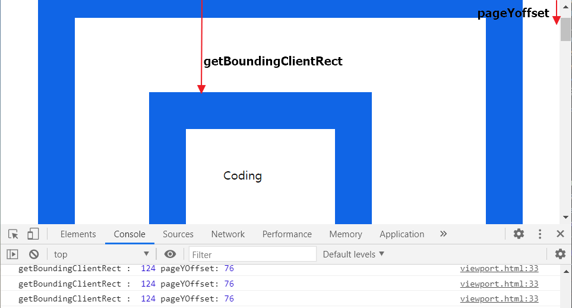

# Javascript 기본

# 목차

- [웹브라우저와 JavaScript](#웹브라우저와-JavaScript)
- [실습방법](#실습방법)
- [HTML에서 javascript로드하기](#HTML에서-javascript로드하기)
  - [inline](#inline)
  - [script](#script)
  - [외부파일로 분리](#외부파일로-분리)
  - [script파일의 위치](#script파일의-위치)
- [Object Model](#Object-Model)
  - [DOM(Document Object Model)](#DOM-Document-Object-Model)
  - [BOM(Browser Object Model)](#BOM-:Browser-Object-Model)
- [BOM](#BOM)
  - [window객체](#Window객체)
  - [전역객체](#전역객체)
  - [사용자와 커뮤니케이션 하기](#사용자와-커뮤니케이션-하기)
    - [alert](#alert)
    - [confirm](#confirm)
    - [prompt](#prompt)
  - [Location객체](#Location객체)
    - [현재 윈도우의 URL알아내기](#현재-윈도우의-URL알아내기)
    - [url parsing](#url-parsing)
    - [url 변경하기](#url-변경하기)
  - [navigator 객체](#navigator-객체)
- [DOM](#DOM)
  - [제어대상을 찾기](#제어대상을-찾기)
  - [document.getElementsByTagName](#getElementsByTagName)
  - [document.getElementsByClassName](#getElementsByClassName)
  - [document.getElementById](#getElementById)
  - [document.querySelector](#querySelector)
  - [document.querySelectorAll](#querySelectorAll)

## 웹브라우저와 JavaScript

- Html은 웹페이지의 표준 언어이자, 정보를 담당한다.
- css는 html를 더 아름답게 꾸며주는 디자이너의 언어이다.
- Javascript는 크게는 웹브라우저,html을 프로그래밍적으로 제어(=동적제어)하는 일을 담당하는 언어이다.

## 실습방법

- 구글 크롬 개발도구(F12) 사용
- blackets 사용

## HTML에서 javascript로드하기

### inline

[inline방식예제](https://github.com/kjhabc2002/TIL/blob/master/javascript/load/inline.html)

inline방식은 태그에 직접 자바스크립트를 기술하는 방식이다.
장점은 태그에 연관된 스크립트가 분명하게 드러난다는 점이다.
하지만 정보와 제어가 섞여 있기 때문에 정보로서의 가치가 떨어진다.

### script

[script방식예제1](https://github.com/kjhabc2002/TIL/blob/master/javascript/load/script1.html)  
script태그를 만들어서 여기에 자바스크립트 코드를 삽입하는 방식이다. html태그와 js코드를 분리할 수 있다는 장점을 가지고 있다.

### 외부파일로 분리

[script방식예제2](https://github.com/kjhabc2002/TIL/blob/master/javascript/load/script2.html)

js를 별도의 파일로 분리할 수 있는데, 더욱 엄격하게 정보와 제어를 분리할 수 있다. 하나의 js파일을 여러 웹페이지에서 로드함으로서 js의 재활용성을 높일 수 있다.
캐쉬를 통해서 속도의 향상, 전송량의 경량화를 도모할 수 있다.그리고 중복을 제거함으로써 유지보수가 편리해진다.

### script파일의 위치

script를 head태그에 위치시킬 수 있다. 하지만 이 경우는 오류가 발생한다.  
[script방식예제3 | 잘못된 방식](https://github.com/kjhabc2002/TIL/blob/master/javascript/load/script3.html)

왜 에러가 발생하는 것일까?

html파일은 위에서부터 아래로 순차적으로 읽으며 실행되는데 script태그를 만나게 되면 js코드로 인식하게 되고, script.js파일을 다운로드한다.
그런 후 script.js파일을 실행시키는데 js파일에서 id값이 hw인 element를 찾게된다. 하지만 body태그까지 실행시키지 않은 상황에서 hw element는 null로 뜨게되고 이로 인해 에러가 발생하게 된다.

해결방법은 다음과 같이 window.onload = function(){} 함수를 적용하면 된다.(window.onload = function(){} 함수는 웹브라우저의 모든 구성요소에 대한 로드가 끝났을 때 브라우저에 의해서 호출되는 함수)  
[script방식예제3 | 올바른 방식](https://github.com/kjhabc2002/TIL/blob/master/javascript/load/script3-1html)

애초에 이런일을 막을 방법은 script파일을 head태그에 두는 것보다 페이지 하단에 위치시키는 방법이 더 낫다.

1. head에 삽입되는 경우

- 브라우저 렌더링에 방해가 되어 무거운 스크립트가 실행되는 경우 오랫동안 완성되지 못한 화면을 노출하게 된다.
- 문서를 초기화하거나 설정하는 가벼운 스크립트들이 자주 사용된다.
- 문서의 DOM구조가 필요한 스크립트의 경우 document.onload와 같은 로드 이벤트가 추가되어야 에러없이 작동된다.

2. body에 삽입되는 경우

- 브라우저가 렌더링이 완료된 상태에서 스크립트가 실행되기에 콘텐츠를 변경하는 스크립트의 경우 화면에 노출된 채로 변화된다.
- 대부분의 스크립트의 위치로 추천되는 위치이다.
- dom구조가 완료된 시점에 실행되기에 별다른 추가설정이 필요없다.

## Object Model

웹브라우저의 구성요소들은 하나하나가 객체화되어 있다. 자바스크립트로 이 객체를 제어해서 웹브라우저를 제어할 수 있게 된다. 이 객체들은 서로 계층적인 관계로 구조화되어 있다. BOM과 DOM은 이 구조를 구성하고 있는 가장 큰 틀의 분류라고 할 수 있다.  


### javascript core

JavaScript 언어 자체에 정의되어 있는 객체들

### DOM :Document Object Model

- 웹페이지의 내용을 제어한다. window의 프로퍼티인 document 프로퍼터에 할당된 Document 객체가 이러한 작업을 담당한다.
- document객체는 body,img 등의 태그를 제어하는데 쓰인다.

### BOM :Browser Object Model

- 웹페이지의 내용을 제외한 브라우저의 각종 요소들을 객체화시킨 것이다. 전역객체 Window의 프로퍼티에 속한 객체들이 이에 속한다.

## BOM

### Window객체

Window 객체는 모든 객체가 소속된 객체이고, 전역객체이면서, 창이나 프레임을 의미한다.

### 전역객체

- 전역객체는 window라는 객체의 메소드를 만드는 것이다.  
  -ㅇWindow 객체는 식별자 window를 통해서 얻을 수 있다. 또한 생략 가능하다.
- 전역변수와 함수는 사실 window객체의 프로퍼티와 메소드라는 것이다. 또한 모든 객체는 사실 window의 자식객체이다.

## 사용자와 커뮤니케이션 하기

html은 form을 통해서 사용자와 커뮤니케이션할 수 있는 기능을 할 수 있다. 자바스크립트에는 사용자와 정보를 주고 받을 수 있는 간편한 수단을 제공한다.

### alert

경고창이라고도 부른다. 사용자에게 정보를 제공해주거나 디버깅 등의 용도로 많이 사용한다.

### confirm

확인을 누르면 true, 취소를 누르면 false를 리턴한다.

[script방식예제3 | 올바른 방식](https://github.com/kjhabc2002/TIL/blob/master/javascript/load/confirm.html)

### prompt

사용자가 입력한 값을 받아서 자바스크립트가 얻어낼 수 있는 기술
[script방식예제3 | 올바른 방식](https://github.com/kjhabc2002/TIL/blob/master/javascript/load/prompt.html)

## Location객체

Location 객체는 문서의 주소와 관련된 객체로 Window 객체의 프로퍼티다. 이 객체를 이용해서 윈도우의 문서 URL을 변경할 수 있고, 문서의 위치와 관련해서 다양한 정보를 얻을 수 있다.

### 현재 윈도우의 URL알아내기

아래는 현재 윈도우의 문서가 위치하는 url을 알아내는 방법이다.

```
console.log(location.toString(), location.href);
```

### url parsing

location 객체는 URL을 의미에 따라서 별도의 프로퍼티로 제공하고 있다.

```
console.log(location.protocol, location.host, location.port, location.pathname, location.search, location.hash)
```

### url 변경하기

- 아래 코드는 현재문서를 http://egoing.net으로 이동한다.

```
location.href = 'http://egoing.net';
```

- 같은 방식임

```
location = 'http://egoing.net';
```

- 현재문서를 리로드하는 간편한 방법을 제공함

```
location.reload();
```

## navigator 객체

브라우저의 정보를 제공하는 객체다. 주로 호환성 문제를 위해 사용한다.

아래 명령을 통해서 이객체의 모든 프로퍼티를 열람할 수 있다.

```
console.dir(navigator);
```

- appName : 웹브라우저의 이름

- appVersion : 브라우저의 버전

- userAgent : 브라우저가 서버측으로 전송하는 user-agent http헤더의 내용

- platform : 브라우저가 동작하고 있는 운영체제에 대한 정보

## DOM

## 제어대상을 찾기

문서 내에서 객체를 찾는 방법은 document 객체의 메소드를 이용한다.

## getElementsByTagName

[getElementsByTagName예제](https://github.com/kjhabc2002/TIL/blob/master/javascript/load/dom_1.html)

getElementsByTagName은 인자로 전달된 태그명에 해당하는 객체들을 찾아서 그 리스트를 NodeList라는 유사 배열에 담아서 반환한다. NodeList는 배열은 아니지만 length와 배열접근연산자를 사용해서 엘리먼트를 조회할 수 있다.

## getElementsByClassName

[getElementsByClassName예제](https://github.com/kjhabc2002/TIL/blob/master/javascript/load/dom_2.html)

class속성 값을 기준으로 객체를 조회할 수 있다.

## getElementById

[document.getElementById예제](https://github.com/kjhabc2002/TIL/blob/master/javascript/load/dom_3.html)

id값을 기준으로 객체를 조회한다. 성능면에서 가장 우수하다.

## querySelector

[document.querySelector예제](https://github.com/kjhabc2002/TIL/blob/master/javascript/load/querySelector.html)

css 선택자의 문법을 이용해서 객체를 조회할수도 있다.

## querySelectorAll

querySelector과 기본적인 동작방법은 같지만 모든 객체를 조회한다는 점이 다르다.
[document.querySelectorAll예제](https://github.com/kjhabc2002/TIL/blob/master/javascript/load/querySelectorAll.html)

## jQuery

jQuery는 DOM을 내부에 감추고 보다 쉽게 웹페이지를 조작할 수 있도록 돕는 도구이다. jQuery의 효용은 후속 수업을 통해서 살펴보자.

jQuery를 사용하기 위해서는 jQuery를 HTML로 로드해야 한다. 아래는 jQuery를 로드하는 방법이다.  
[jQuery예제](https://github.com/kjhabc2002/TIL/blob/master/javascript/load/jquery.html)

## 라이브러리

자주 사용하는 로직을 재사용할 수 있도록 고안된 소프트웨어를 라이브러리라고 한다.

## 제어대상을 찾기

jQuery를 이용하면 DOM을 사용하는 것 보다 훨씬 효율적으로 필요한 객체를 조회할 수 있다. jQuery는 객체를 조회할 때 CSS 선택자를 이용한다.

## jQuery의 기본문법

\$()는 jQuery의 함수이다. 이 함수의 인자로 css선택자(li)를 전달하면 jQuery객체라는 것을 리턴한다. 이 객체는 선택자에 해당하는 엘리먼트를 제어하는 다양한 메소드를 가지고 있다. 아래 그림에서 css는 선택자에 해당하는 객체들의 style에 color:red로 변경한다.


## jQuery 사용예제

## HTMLelement

- document.getElementById : 리턴 데이터 타입은 HTMLLIELement, 실행결과 하나인 경우
- document.getElementsByTagName : 리턴 데이터 타입은 HTMLCollection, 실행결과 복수인 경우

## DOM Tree

모든 엘리먼트는 HTMLElement의 자식이다. 따라서 HTMLElement의 프로퍼티를 똑같이 가지고 있다. 동시에 엘리먼트의 성격에 따라서 자신만의 프로퍼티를 가지고 있는데 이것은 엘리먼트의 성격에 따라서 달라진다. HTMLElement는 Element의 자식이고 Element는 Node의 자식이다. Node는 Object의 자식이다. 이러한 관계를 DOM Tree라고 한다.


## HTMLCollection

HTMLCollection은 리턴결과가 복수인 경우에 사용하게 되는 객체다. 유사배열로 배열과 비슷한 사용방법을 가지고 있지만 배열은 아니다.

[HTMLCollection예제](https://github.com/kjhabc2002/TIL/blob/master/javascript/load/htmlcollection.html)

결과  


## jQuery 객체란

jQuery 함수의 리턴값으로 jQuery 함수를 이용해서 선택한 엘리먼트들에 대해서 처리할 작업을 프로퍼티로 가지고 있는 객체다.

### 암시적 반복

jQuery 객체의 가장 중요한 특성은 암시적인 반복을 수행한다는 것이다. DOM과 다르게 jQuery 객체의 메소드를 실행하면 선택된 엘리먼트 전체에 대해서 동시에 작업이 처리된다.

암시적 반복은 값을 설정할 때만 동작한다. 값을 가져올 때는 선택된 엘리먼트 중 첫번째에 대한 값만을 반환한다. 이에 대한 내용은 아래에서 살펴본다.

### 체이닝

chainig이란 선택된 엘리먼트에 대해서 연속적으로 작업을 처리할 수 있는 방법이다.  
[체이닝예제](https://github.com/kjhabc2002/TIL/blob/master/javascript/load/chaining.html)

한가지 주의할 것은 li[i]의 값은 해당 엘리먼트에 대한 jQuery 객체가 아니라 DOM 객체라는 것이다. 따라서 jQuery의 기능을 이용해서 이 객체를 제어하려면 jQuery 함수를 이용해야 한다.

```
for(var i=0; i<li.length; i++){
    $(li[i]).css('color', 'red');
}
```

### map

map은 jQuery 객체의 엘리먼트를 하나씩 순회한다. 이 때 첫번째 인자로 전달된 함수가 호출되는데 첫번째 인자로 엘리먼트의 인덱스, 두번째 인자로 엘리먼트 객체(DOM)이 전달된다.

### api

제어할 대상을 선택한 후에는 대상에 대한 연산을 해야한다. .css와 .attr은 jQuery 객체가 가지고 있는 메소드 중의 하나인데, jQuery는 그 외에도 많은 API를 제공하고 있다. 이에 대한 내용은 jQuery API를 참고하자.

## element 개체

### 소개

element객체는 엘리먼트를 추상화한 객체다. HTMLElement 객체와의 관계를 이해하기 위해서는 DOM의 취지에 대한 이해가 선행되야 한다. DOM은 HTML만을 제어하기 위한 모델이 아니다. HTML이나 XML, SVG, XUL과 같이 마크업 형태의 언어를 제어하기 위한 규격이기 때문에 Element는 마크업 언어의 일반적인 규격에 대한 속성을 정의하고 있고, 각각의 구체적인 언어(HTML,XML,SVG)를 위한 기능은 HTMLElement, SVGElement, XULElement와 같은 객체를 통해서 추가해서 사용하고 있다.

### 다른 객체들과의 관계

DOM의 계층구조에서 Element 객체의 위치는 아래와 같다.


### 주요기능

### 식별자

문서 내에서 특정한 엘리먼트를 식별하기 위한 용도로 사용되는 api

- Element.classList
- Element.className
- Element.id
- Element.tagName

### 조회

엘리먼트의 하위 엘리먼트를 조회하는 api

- Element.getElementsByClassName
- Element.getElementsByTagName
- Element.querySelector
- Element.querySelectorAll

### 속성

엘리먼트의 속성을 알아내고 변경하는 api

- Element.getAttribute(name)
- Element.setAttribute(name, value)
- Element.hasAttribute(name);
- Element.removeAttribute(name);

## 식별자 API

엘리먼트를 제어하기 위해서는 그 엘리먼트를 조회하기 위한 식별자가 필요하다. 본 수업에서는 식별자 API들에 대해서 알아보자.
HTML에서 엘리먼트의 이름과 id 그리고 class는 식별자로 사용된다. 식별자 API는 이 식별자를 가져오고 변경하는 역할을 한다.

### Element.tagName

해당 엘리먼트의 태그 이름을 알아낸다. 태그 이름을 변경하지는 못한다.
[체이닝예제](https://github.com/kjhabc2002/TIL/blob/master/javascript/load/chaining.html)

### Element.id

[엘리먼트예제1](https://github.com/kjhabc2002/TIL/blob/master/javascript/load/elementId.html)

문서에서 id는 단 하나만 등장할 수 있는 식별자다. 아래 예제는 id의 값을 읽고 변경하는 방법을 보여준다.

### Element.className

[엘리먼트예제2](https://github.com/kjhabc2002/TIL/blob/master/javascript/load/className.html)
클래스는 여러개의 엘리먼트를 그룹핑할 때 사용한다.

### Element.classList

[엘리먼트예제1](https://github.com/kjhabc2002/TIL/blob/master/javascript/load/classList.html)
className에 비해서 훨씬 편리한 사용성을 제공한다.

## 조회API

조회 API는 엘리먼트를 조회하는 기능이다. 조회 방법에 대해서는 이미 여러차례 살펴봤기 때문에 이번 시간에 알아볼 내용은 조회 대상을 제한하는 방법에 대한 것이다.

지금까지 document.getElementsBy* 메소드를 통해서 엘리먼트를 조회했다. document 객체는 문서 전체를 의미하는 엘리먼트이기 때문에 document의 조회 메소드는 문서 전체를 대상으로 엘리먼트를 조회한다. Element 객체 역시도 getElementsBy* 엘리먼트를 가지고 있는데 Element 객체의 조회 메소드는 해당 엘리먼트의 하위 엘리먼트를 대상으로 조회를 수행한다.

### attribute

[api속성예제1](https://github.com/kjhabc2002/TIL/blob/master/javascript/load/api_2.html)
속성은 HTML에서 태그명만으로는 부족한 부가적인 정보라고 할 수 있다. 이 속성을 어떻게 제어하는가 알아보자.

속성을 제어하는 API는 아래와 같다. 각각의 기능은 이름을 통해서 충분히 유추할 수 있을 것이다.

- Element.getAttribute(name)
- Element.setAttribute(name, value)
- Element.hasAttribute(name);
- Element.removeAttribute(name);

### 속성과 프로퍼티

모든 엘리먼트의 (HTML)속성은 (JavaScript 객체의) 속성과 프로퍼티로 제어가 가능하다.

[api속성예제2](https://github.com/kjhabc2002/TIL/blob/master/javascript/load/api_3.html)

setAttribute('class', 'important')와 className = 'important'는 같은 결과를 만든다. 하지만 전자는 attribute 방식(속성이라고 부르겠다)이고 후자는 property 방식이다. property 방식은 좀 더 간편하고 속도도 빠르지만 실제 html 속성의 이름과 다른 이름을 갖는 경우가 있다. 그것은 자바스크립트의 이름 규칙 때문이다.

[api속성예제3](https://github.com/kjhabc2002/TIL/blob/master/javascript/load/api_3.html)

심지어 속성과 프로퍼티는 값이 다를수도 있다. 아래 코드를 실행한 결과는 속성과 프로퍼티의 값이 꼭 같은 것은 아니라는 것을 보여준다.

[api속성예제3](https://github.com/kjhabc2002/TIL/blob/master/javascript/load/api_3.html)

## jQuery 속성제어 api

### 속성제어

jQuery 객체의 메소드 중 setAttribute, getAttribute에 대응되는 메소드는 attr이다. 또한 removeAttribute에 대응되는 메소드로는 removeAttr이 있다.

### attribute와 property

DOM과 마찬가지로 jQuery도 속성(attribute)과 프로퍼티를 구분한다. 속성은 attr, 프로퍼티는 prop 메소드를 사용한다.

[jquery속성예제](https://github.com/kjhabc2002/TIL/blob/master/javascript/load/attr_prop.html)

jQuery를 이용하면 프로퍼티의 이름으로 어떤 것을 사용하건 올바른 것으로 교정해준다. 이런 것이 라이브러리를 사용하는 의의라고 할수 있겠다.

## jQuery 조회범위제한

이전 수업에서 Element 객체에서 getElementsBy\* 메소드를 실행하면 조회의 범위가 그 객체의 하위 엘리먼트로 제한된다는 것을 알아봤다. jQuery에서는 어떻게 이러한 작업을 할 수 있을까?

### selector context

가장 간편한 방법은 조회할 때 조회 범위를 제한하는 것이다. 그 제한된 범위를 jQuery에서는 selector context라고 한다.

### .find()

[find예제](https://github.com/kjhabc2002/TIL/blob/master/javascript/load/limit_1.html)
find는 jQuery 객체 내에서 엘리먼트를 조회하는 기능을 제공한다.

```
$( "#active").find('.marked').css( "background-color", "red" );
```

find를 쓰는 이유는 체인을 끊지 않고 작업의 대상을 변경하고 싶을 때 사용한다.

```
$('#active').css('color','blue').find('.marked').css( "background-color", "red" );
```

## Node객체

### 소개

Node 객체는 DOM에서 시조와 같은 역할을 한다. 다시 말해서 모든 DOM 객체는 Node 객체를 상속 받는다. Node 객체의 위상을 그림으로 나타내면 아래와 같다.


### 주요기능

Node 객체의 주요한 임무는 아래와 같다.

### 관계

엘리먼트는 서로 부모, 자식, 혹은 형제자매 관계로 연결되어 있다. 각각의 Node가 다른 Node와 연결된 정보를 보여주는 API를 통해서 문서를 프로그래밍적으로 탐색할 수 있다.

- Node.childNodes
- Node.firstChild
- Node.lastChild
- Node.nextSibling
- Node.previousSibling
- Node.contains()
- Node.hasChildNodes()

### 노드의 종류

Node 객체는 모든 구성요소를 대표하는 객체이기 때문에 각각의 구성요소가 어떤 카테고리에 속하는 것인지를 알려주는 식별자를 제공한다.

- Node.nodeType
- Node.nodeName

### 값

Node 객체의 값을 제공하는 API

- Node.nodeValue
- Node.textContent

### 자식관리

Node 객체의 자식을 추가하는 방법에 대한 API

- Node.appendChild()
- Node.removeChild()

## Node관계 API

node 객체는 Node 간의 관계 정보를 담고 있는 일련의 API를 가지고 있다. 다음은 관계와 관련된 프로퍼티들이다.

- childNodes : 자식객체들을 유사배열로 반환
- firstChild, lastChild : 특정 위치의 자식배열 반환
- nextSibiling : 다음 위치의 노드 반환
- previousSibiling : 이전 위치의 노드반환
- parentNode : 부모객체 반환

[node예제1 | 노드와 노드사이의 관계알아보기](https://github.com/kjhabc2002/TIL/blob/master/javascript/load/node_1.html)

`<body id="start">`

- `var start = document.getElementById('start');` -`start.firstChild`
  - return `#text` - body의 첫번째 자식이 ul이 아니라는 것 - 그러면 #text는 뭘까?
    
    - 위와 같이 body태그와 ul태그 사이의 공백문자로 유추해볼 수 있음
  - body태그와 ul태그 사이의 공백이 없는 상태라면
    - start.firstChild 시 `<ul></ul>` 이 리턴됨
  - start.firstChild.nextSibling
    - 같은 레벨에 있는 단위를 nextSibling 이라고 지칭함
    - body태그와 ul태그를 붙이지 않아도 `<ul></ul>` 이 리턴됨
  - ul 다음의 li 태그도 firstChild.nextSibling 형식으로 접근
  - `start.childNodes` - 유사배열로 자식 엘리먼트들을 리턴함
    

## 노드종류 API

노드 작업을 하게 되면 현재 선택된 노드가 어떤 타입인지를 판단해야 하는 경우가 있다. 이런 경우에 사용할 수 있는 API가 nodeType, nodeName이다.

- Node.nodeType : node의 타입을 의미한다.
- Node.nodeName : node의 이름 (태그명을 의미한다.)

### Node Type

노드의 종류에 따라서 정해진 상수가 존재한다. 아래는 모든 노드의 종류와 종류에 따른 값을 출력하는 예제다.

```
for(var name in Node){
   console.log(name, Node[name]);
}
```

아래 예제는 노드 종류 API를 이용해서 노드를 처리하는 예제다. 함수가 자기 자신을 호출하는 것을 재귀함수라고 하는데 본 예제는 재귀 함수의 예를 보여준다.
[node예제2](https://github.com/kjhabc2002/TIL/blob/master/javascript/load/node_2.html)

## 노드 변경API

### 노드 추가

[node예제3](https://github.com/kjhabc2002/TIL/blob/master/javascript/load/node_3.html)  
노드의 추가와 관련된 API들은 아래와 같다.

- appendChild(child) : 노드의 마지막 자식으로 주어진 엘리먼트 추가
- insertBefore(newElement, referenceElement) : appendChild와 동작방법은 같으나 두번째 인자로 엘리먼트를 전달 했을 때 이것 앞에 엘리먼트가 추가된다.

노드를 추가하기 위해서는 추가할 엘리먼트를 생성해야 하는데 이것은 document 객체의 기능이다. 아래 API는 노드를 생성하는 API이다.

- document.createElement(tagname) : 엘리먼트 노드를 추가한다.
- document.createTextNode(data) : 텍스트 노드를 추가한다.

### 노드 제거

[node예제4](https://github.com/kjhabc2002/TIL/blob/master/javascript/load/node_4.html)  
노드 제거를 위해서는 아래 API를 사용한다. 이 때 메소드는 삭제 대상의 부모 노드 객체의 것을 실행해야 한다는 점에 유의하자.

- removeChild(child)

### 노드 바꾸기

[node예제5](https://github.com/kjhabc2002/TIL/blob/master/javascript/load/node_5.html)

- replaceChild(newChild, oldChild)

## jQuery 노드 변경API

### 추가

추가와 관련된 주요한 메소드는 4가지다. 각각의 관계를 그림으로 나타내면 아래와 같다.


[node예제6](https://github.com/kjhabc2002/TIL/blob/master/javascript/load/node_6.html)

### 제거

제거와 관련된 API는 remove와 empty가 있다. remove는 선택된 엘리먼트를 제거하는 것이고 empty는 선택된 엘리먼트의 텍스트 노드를 제거하는 것이다.

[node예제7](https://github.com/kjhabc2002/TIL/blob/master/javascript/load/node_7.html)

### 바꾸기

replaceAll과 replaceWith는 모두 노드의 내용을 교체하는 API이다. replaceWith가 제어 대상을 먼저 지정하는 것에 반해서 replaceAll은 제어 대상을 인자로 전달한다

[node예제8](https://github.com/kjhabc2002/TIL/blob/master/javascript/load/node_8.html)

### 복사

노드를 복사하는 방법  
[node예제9](https://github.com/kjhabc2002/TIL/blob/master/javascript/load/node_9.html)

### 이동

dom manipulation API의 인자로 특정 노드를 선택하면 이동의 효과가 난다.  
[node예제10](https://github.com/kjhabc2002/TIL/blob/master/javascript/load/node_10.html)

## 문자열로 노드제어

노드 변경 API에서는 여러 메소드를 이용해서 노드를 제어하는 방법에 대해서 알아봤다. 그런데 이 방식은 복잡하고 장황하다. 좀 더 편리하게 노드를 조작하는 방법을 알아보자.

### inneHTML

innerHTML는 문자열로 자식 노드를 만들 수 있는 기능을 제공한다. 또한 자식 노드의 값을 읽어올 수도 있다.

[innerHTML예제](https://github.com/kjhabc2002/TIL/blob/master/javascript/load/inner.html)

### outerHTML

outerHTML은 선택한 엘리먼트를 포함해서 처리된다.문자열을 리턴하고, 값을 변경시 HTML 코드를 빼고 추가한다.  
[outerHTML예제](https://github.com/kjhabc2002/TIL/blob/master/javascript/load/outer.html)

### innerText, outerText

innerHtml, outerHTML과 다르게 이 API들은 값을 읽을 때는 HTML 코드를 제외한 문자열을 리턴하고, 값을 변경할 때는 HTML의 코드를 그대로 추가한다.  
[inner_outerText예제](https://github.com/kjhabc2002/TIL/blob/master/javascript/load/inner_outer.html)

### insertAdjacentHTML

좀 더 정교하게 문자열을 이용해서 노드를 변경하고 싶을 때 사용한다.  
추가할 코드 위치를 조정할 수 있음  
[inner_outerText예제](https://github.com/kjhabc2002/TIL/blob/master/javascript/load/inner_outer.html)

- 변경할 코드의 부모객체.insertAdjacentHTML('beforebegin','넣을내용')
  - 1번째의 앞에 넣음
- 변경할 코드의 부모객체.insertAdjacentHTML(afterbegin','넣을 내용');
  - 1번째의 뒤에 넣음
- 변경할 코드의 부모객체.insertAdjacentHTML('beforeend','넣을 내용'); -막내 앞에
- 변경할 코드의 부모객체.insertAdjacentHTML('afterend','넣을 내용'); -막내 뒤에

## Document 객체


document객체는 dom의 스팩이고 이것이 웹브라우저에서는 HTMLDocument 객체로 사용된다. HTMLDocument 객체는 문서 전체를 대표하는 객체라고 할 수 있다.

```
<script>
//document 객체는 window 객체의 소속이다.
console.log(window.document);
//document 객체의 자식으로는 Doctype과 html이 있다.
console.log(window.document.childNodes[0]);
console.log(window.document.childNodes[1]);
</script>
```

### 주요API

### 노드 생성API

- createElement()
- createTextNode()

### 문서 정보API

- title
- URL
- referrer
- lastModified

## Text 객체

  
텍스트 객체는 텍스트 노드에 대한 DOM 객체로 CharcterData를 상속 받는다.  
아래는 텍스트 노드를 찾는 예제다. 주목할 것은 DOM에서는 공백이나 줄바꿈도 텍스트 노드라는 점이다.

```
<p id="target1"><span>Hello world</span></p>
<p id="target2">
    <span>Hello world</span>
</p>
<script>
var t1 = document.getElementById('target1').firstChild;
var t2 = document.getElementById('target2').firstChild;

console.log(t1.firstChild.nodeValue);
try{
    console.log(t2.firstChild.nodeValue);
} catch(e){
    console.log(e);
}
console.log(t2.nextSibling.firstChild.nodeValue);

</script>
```

### 주요기능

### 값

텍스트 노드의 값을 가져오는 api

- data
- nodeValue

### 조작

- appendData()
- deleteData()
- insertData()
- replaceData()
- subStringData()

### 생성

- [document.createTextNode()](http://opentutorials.org/module/904/6701)

## 값API

텍스트 노드는 DOM에서 실질적인 데이터가 저장되는 객체이다. 따라서 텍스트 노드에는 값과 관련된 여러 기능들이 있는데 이번 시간에는 값을 가져오는 두개의 API를 알아본다

- nodeValue
- data

```
<ul>
    <li id="target">html</li>
    <li>css</li>
    <li>JavaScript</li>
</ul>
<script>
    var t = document.getElementById('target').firstChild;
    console.log(t.nodeValue);
    console.log(t.data);
</script>
```

## 조작API

[조작API예제](https://github.com/kjhabc2002/TIL/blob/master/javascript/load/text_2.html)

텍스트 노드가 상속 받은 CharacterData 객체는 문자를 제어할 수 있는 다양한 API를 제공한다. 아래는 조작과 관련된 API들의 목록이다.

- appendData()
- deleteData()
- insertData()
- replaceData()
- substringData()

## 문서의 기하학적 특성

요소들의 위치와 크기를 알아내는 방법을 배워보자

### 요소의 크기와 위치

```
<style>
    body{
        padding:0;
        margin:0;
    }
    #target{
        width:100px;
        height:100px;
        border:50px solid #1065e6;
        padding:50px;
        margin:50px;
    }
</style>
<div id="target">
    Coding
</div>
<script>
var t = document.getElementById('target');
console.log(t.getBoundingClientRect());
</script>
```

화면에 표시된 모습은 다음과 같다.


즉 엘리먼트의 테두리와 body 태그 사이의 거리가 50px이다. 그리고 테두리를 포함한 엘리먼트의 크기는 300px이다. 이 값을 알아내고 싶을 때 사용하는 API가 getBoundingClientRect이다. 이를 콘솔에서 실행한 결과는 아래와 같다.


즉 엘리먼트의 크기와 위치를 알고 싶을 때는 getBoundingClientRect를 사용하면 된다는 것을 알 수 있다.

> getBoundingClientRect의 width 값을 IE는 제공하지 않는다.  
> 만약 엘리먼트가 중첩되어 있다면 어떻게 될까?  
>   
> 위와 같이 엘리먼트를 중첩했을 때 coding 엘리먼트와 문서와의 거리는 200px이다. getBoundingClientRect를 호출해보자.

```
<style>
    body{
        padding:0;
        margin:0;
    }
    div{
        border:50px solid #1065e6;
        padding:50px;
        margin:50px;
    }
    #target{
        width:100px;
        height:100px;
    }
</style>
<div>
    <div id="target">
        Coding
    </div>
</div>
<script>
var t = document.getElementById('target');
console.log(t.getBoundingClientRect());
console.log(t.offsetParent);
</script>
```

실행 결과는 아래와 같다.  


즉 엘리먼트의 위치를 의미하는 top, right의 값을 통해서 기준이 그 부모가 아니라 body라는 것을 알 수 있다. 그리고 이를 명시적으로 확인할 수 있는 방법은 offsetParent 속성을 호출하는 것이다. 만약 부모 중 CSS position의 값이 static인 td, th, table 엘리먼트가 있다면 이 엘리먼트가 offsetParent가 된다.

> 오래된 브라우저에서는 getBoundingClientRect를 지원하지 않을 수 있기 때문에 이런 경우 offsetLeft와 offsetTop 프로퍼티를 사용한다.

테두리를 제외한 엘리먼트의 크기를 알고 싶다면 ClientWidth, ClientHeight를 사용한다.

```
<script>
var t = document.getElementById('target');
console.log('clientWidth:', t.clientWidth, 'clientHeight:', t.clientHeight);
</script>
```

### Viewport

요소의 위치를 생각할 때는 사실 조금 더 복잡해진다. 문서가 브라우저의 크기보다 큰 경우는 스크롤이 만들어지는데 스크롤에 따라서 위치의 값이 달라지기 때문이다. 이를 이해하기 위해서는 우선 viewport에 대한 이해가 선행되어야 한다.


아래의 예제는 1초에 한번씩 getBoundingClientRect의 top 속성과 window.pageYOffset의 값이 출력된다.  
[viewport예제](https://github.com/kjhabc2002/TIL/blob/master/javascript/load/viewport.html)

getBoundingClientRect : 문서의 body태그에서부터 엘리먼트까지의 거리가 아니고,
viewport에서부터 엘리먼트까지의 거리를 알려주는 역할을 한다.(=viewport의 좌표)



이를 통해서 알 수 있는 것은 getBoundingClientRect의 값이 스크롤에 따라서 달라지는 뷰포트의 좌표를 사용하고 있다는 것이다. 또한 스크롤의 정도를 알고 싶을 때는 pageYOffset을 사용하면 된다는 것도 알 수 있다.

### 문서의 좌표

그럼 문서의 좌표를 알고 싶으면 어떻게 해야 하나? 뷰포트의 좌표에 스크롤된 정도를 더해서 알 수 있다. 아래와 같이 코드를 조금 수정했다.

```
setInterval(function(){
    console.log('getBoundingClientRect : ', t.getBoundingClientRect().top, 'pageYOffset:', window.pageYOffset, 'document y:', t.getBoundingClientRect().top+window.pageYOffset);
}, 1000)
```

### 스크롤

문서의 스크롤 값을 변경하는 것은 어떻게 하는 것일까? scrollLeft와 scrollTop 프로퍼티를 이용하면 된다.

[scroll예제](https://github.com/kjhabc2002/TIL/blob/master/javascript/load/scroll.html)

### 스크린의 크기

스크린의 크기는 모니터의 크기와 브라우저 뷰포트의 크기가 있다.

- window.ineer\* : 뷰포트의 크기
- screen.\* : 사용자의 웹브라우저 모니터의 크기

[scroll예제](https://github.com/kjhabc2002/TIL/blob/master/javascript/load/screen.html)

## 이벤트

이벤트(event)는 어떤 사건을 의미한다. 브라우저에서의 사건이란 사용자가 클릭을 했을 '때', 스크롤을 했을 '때', 필드의 내용을 바꾸었을 '때'와 같은 것을 의미한다.

[event예제](https://github.com/kjhabc2002/TIL/blob/master/javascript/load/event.html)

onclick 속성의 자바스크립트 코드(alert(window.location))는 사용자가 이 버튼을 클릭 했을 '때' 실행된다. 즉 js 개발자는 어떤 일이 발생했을 때 실행 되어야 하는 코드를 등록하고, 브라우저는 그 일이 발생했을 때 등록된 코드를 실행하게 된다. 이러한 방식을 이벤트 프로그래밍이라고 한다.

### event target

arget은 이벤트가 일어날 객체를 의미한다. 아래 코드에서 타겟은 버튼 태그에 대한 객체가 된다.

```
<input type="button" onclick="alert(window.location)" value="alert(window.href)" />
```

### event type

이벤트의 종류를 의미한다. 위의 예제에서는 click이 이벤트 타입이다. 그 외에도 scroll은 사용자가 스크롤을 움직였다는 이벤트이고, mousemove는 마우스가 움직였을 때 발생하는 이벤트이다

이벤트의 종류는 이미 약속되어 있다. 아래 링크는 브라우저에서 지원하는 이벤트의 종류를 보여준다.

https://developer.mozilla.org/en-US/docs/Web/Reference/Events

### event handler

이벤트가 발생했을 때 동작하는 코드를 의미한다. 위의 예제에서는 alert(window.location)이 여기에 해당한다.

## 등록방법

이벤트 프로그래밍을 하기 위해서는 이벤트의 대상에 이벤트 핸들러를 등록해줘야 한다. 웹브라우저에서는 크게 3가지 종류의 등록방법을 제공하는데 하위 토픽에서 자세한 내용을 알아보겠다.

### inline

인라인(inline) 방식으로 이벤트를 등록하는 방법을 알아보자. 인라인 방식은 이벤트를 이벤트 대상의 태그 속성으로 지정하는 것이다.

```
input type="button" onclick="alert('Hello world');" value="button" />
```

이벤트가 발생한 대상을 필요로하는 경우 this를 통해서 참조할 수 있다.(this는 자기자신)

인라인 방식은 태그에 이벤트가 포함되기 때문에 이벤트의 소재를 파악하는 것이 편리하다. 하지만 정보인 HTML과 제어인 JavaScript가 혼재된 형태이기 때문에 바람직한 방법이라고 할수는 없다.

## 프로퍼티 리스너

프로퍼티 리스너 방식은 이벤트 대상에 해당하는 객체의 프로퍼티로 이벤트를 등록하는 방식이다. 인라인 방식에 비해서 HTML과 JavaScript를 분리할 수 있다는 점에서 선호되는 방식이지만 뒤에서 배울 addEventListener 방식을 추천한다.

```
<input type="button" id="target" value="button" />
<script>
    var t = document.getElementById('target');
    t.onclick = function(){
        alert('Hello world');
    }
</script>
```

### 이벤트 객체

이벤트가 실행된 맥락의 정보가 필요할 때는 이벤트 객체를 사용한다. 이벤트 객체는 이벤트가 실행될 때 이벤트 핸들러의 인자로 전달된다.

```
<body>
    <input type="button" id="target" value="button" />
<script>
    var t = document.getElementById('target');
    t.onclick = function(event){
        alert('Hello world, '+event.target.value)
    }
</script>
```

## addEventListener()

addEventListener은 이벤트를 등록하는 가장 권장되는 방식이다. 이 방식을 이용하면 여러개의 이벤트 핸들러를 등록할 수 있다.

```
<input type="button" id="target" value="button" />
<script>
    var t = document.getElementById('target');
    t.addEventListener('click', function(event){
        alert('Hello world, '+event.target.value);
    });
</script>
```

이 방식의 중요한 장점은 하나의 이벤트 대상에 복수의 동일 이벤트 타입 리스너를 등록할 수 있다는 점이다.

```
<input type="button" id="target" value="button" />
<script>
    var t = document.getElementById('target');
    t.addEventListener('click', function(event){
        alert(1);
    });
    t.addEventListener('click', function(event){
        alert(2);
    });
</script>
```

이벤트 객체를 이용하면 복수의 엘리먼트에 하나의 리스너를 등록해서 재사용할 수 있다.

```
<input type="button" id="target1" value="button1" />
<input type="button" id="target2" value="button2" />
<script>
    var t1 = document.getElementById('target1');
    var t2 = document.getElementById('target2');
    function btn_listener(event){
        switch(event.target.id){
            case 'target1':
                alert(1);
                break;
            case 'target2':
                alert(2);
                break;
        }
    }
    t1.addEventListener('click', btn_listener);
    t2.addEventListener('click', btn_listener);
</script>
```

## 이벤트 전파😵

html태그는 중첩되어 있다. 따라서 특정한 태그에서 발생하는 이벤트는 중첩되어 있는 태그들 모두가 대상이 될 수 있다. 이런 경우 중첩된 태그들에 이벤트가 등록 되어 있다면 어떻게 처리 될까?

### 캡처링

[캡처링예제1](https://github.com/kjhabc2002/TIL/blob/master/javascript/load/capturing_1.html)

실행결과

```
INPUT HTML capturing
INPUT BODY capturing
INPUT FIELDSET capturing
INPUT INPUT target
```

이벤트가 부모에서부터 발생해서 자식으로 전파되고 있다. 이러한 방식을 capturing이라고 한다.

### 버블링

이벤트 전파에서 실세다. (많이 쓰임)  
[캡처링예제2](https://github.com/kjhabc2002/TIL/blob/master/javascript/load/capturing_2.html)  
위의 캡쳐링예제에서 true-> false로 바꾸어보자.

```
document.getElementById('target').addEventListener('click', handler, false);
document.querySelector('fieldset').addEventListener('click', handler, false);
document.querySelector('body').addEventListener('click', handler, false);
document.querySelector('html').addEventListener('click', handler, false);
```

실행결과

```
INPUT INPUT target
INPUT FIELDSET bubbling
INPUT BODY bubbling
INPUT HTML bubbling
```

이번에는 순서가 반대로 되었다. 자식부터 부모로 이벤트가 전파되는 것을 버블링(bubbling)이라고 한다.

아래 예제와 같이 이벤트 전파를 중간에 가로막을 수도 있다.

[버블링 예제](https://github.com/kjhabc2002/TIL/blob/master/javascript/load/capturing_2.html)

실행결과 : body태그까지 전파된다.

```
INPUT INPUT target
INPUT FIELDSET bubbling
INPUT BODY bubbling
```

## 기본동작의 취소

웹브라우저의 구성요소들은 각각 기본적인 동작 방법을 가지고 있다.

- 텍스트 필드에 포커스를 준 상태에서 키보드를 입력하면 텍스트가 입력된다.
- 폼에서 submit 버튼을 누르면 데이터가 전송된다.
- a 태그를 클릭하면 href 속성의 URL로 이동한다.

이러한 기본적인 동작들을 기본 이벤트라고 하는데 사용자가 만든 이벤트를 이용해서 이러한 기본 동작을 취소할 수 있다.

### inline

이벤트의 리턴값이 false이면 기본 동작이 취소된다.  
[inline예제](https://github.com/kjhabc2002/TIL/blob/master/javascript/load/inline.html)

## 이벤트 타입

아래는 onclick 이벤트 타입의 예제다. 이벤트 타입이라는 것은 이벤트의 종류라고 할 수 있다.

`<input type="button" onclick="alert(1);" />`

웹브라우저는 많은 종류의 이벤트 타입을 제공한다. 하위 토픽에서는 주요한 이벤트 타입을 중심으로 어떤 이벤트 타입이 있는지 알아보겠다.

## 폼

폼과 관련된 이벤트 타입을 알아보자.

### submit

submit은 폼의 정보를 서버로 전송하는 명령인 submit시에 일어난다.

form태그에 적용된다.

아래예제는 전송 전에 텍스트 필드에 값이 입력되었는지를 확인한다. 만약 값이 입력되지 않았다면 전송을 중단한다.

[submit예제](https://github.com/kjhabc2002/TIL/blob/master/javascript/load/submit.html)

### change

change는 폼 컨트롤의 값이 변경 되었을 때 발생하는 이벤트다.

input(text,radio,checkbox), textarea, select 태그에 적용된다.  
[change예제](https://github.com/kjhabc2002/TIL/blob/master/javascript/load/change.html)

### blur,focus

focus는 엘리먼트에 포커스가 생겼을 때, blur은 포커스가 사라졌을 때 발생하는 이벤트다.
다음 태그를 제외한 모든 태그에서 발생한다. `<base>, <bdo>, <br>, <head>, <html>, <iframe>, <meta>, <param>, <script>, <style>, <title> `  
[blur,focus예제](https://github.com/kjhabc2002/TIL/blob/master/javascript/load/blur_focus.html)

## 문서로딩

웹페이지를 프로그래밍적으로 제어하기 위해서는 웹페이지의 모든 요소에 대한 처리가 끝나야한다. 이것을 알려주는 이벤트는 load, DOMContentLoaded이다.

아래 코드의 실행결과는 null이다. `<p id="target">Hello</p>`가 로딩되기 전에 자바스크립트가 실행되었기 때문이다.

```
<html>
    <head>
        <script>
        var t = document.getElementById('target');
        console.log(t);
        </script>
    </head>
    <body>
        <p id="target">Hello</p>
    </body>
</html>
```

이를 해결하기 위한 방법은 아래와 같이 스크립트를 문서 끝에 위치시키는 것이다.

```
<p id="target">Hello</p>
<script>
    var t = document.getElementById('target');
    console.log(t);
</script>
```

또 다른 방법은 load 이벤트를 이용하는 것이다.

```
<head>
    <script>
        window.addEventListener('load', function(){
            var t = document.getElementById('target');
            console.log(t);
        })
    </script>
</head>
<body>
    <p id="target">Hello</p>
</body>
```

그런데 load 이벤트는 문서내의 모든 리소스(이미지, 스크립트)의 다운로드가 끝난 후에 실행된다. 이것을 에플리케이션의 구동이 너무 지연되는 부작용을 초래할 수 있다.

DOMContentLoaded는 문서에서 스크립트 작업을 할 수 있을 때 실행되기 때문에 이미지 다운로드를 기다릴 필요가 없다.

```
<html>
    <head>
        <script>
            window.addEventListener('load', function(){
                console.log('load');
            })
            window.addEventListener('DOMContentLoaded', function(){
                console.log('DOMContentLoaded');
            })
        </script>
    </head>
    <body>
        <p id="target">Hello</p>
    </body>
</html>
```

## 마우스

[마우스예제](https://github.com/kjhabc2002/TIL/blob/master/javascript/load/mouse.html)

### 이벤트 타입

웹브라우저는 마우스와 관련해서 다양한 이벤트 타입을 지원한다.

- click : 클릭했을 때 발생하는 이벤트.
- dbclick : 더블클릭 했을 때 발생하는 이벤트
- mousedown : 마우스를 누를때 발생
- mouseup : 마우스를 땔 때 발생
- mousemove : 마우스를 움직일때
- mouseover : 마우스가 엘리먼트에 진입했을 때 발생
- mouseout : 마우스가 엘리먼트에서 빠져나갈 때 발생
- contextmenu : 컨텍스트 메뉴가 실행될때 발생

### 키보드 조합

마우스 이벤트가 호출될 때 특수키(alt, ctrl, shift)가 눌려진 상태를 감지해야 한다면 이벤트 객체의 프로퍼티를 사용한다. 이 때 사용하는 프로퍼티는 아래와 같다.

- event.shiftKey
- event.altKey
- event.ctrlKey

### 마우스 포인터 위치

마우스 이벤트와 관련한 작업에서는 마우스 포인터의 위치를 알아내는 것이 중요할 때가 있는데 이런 경우 이벤트 객체의 clientX와 clientY를 사용한다.

## jQuery이벤트

jQuery는 이벤트와 관련해서 편리한 기능을 제공한다.
아래 예제는 직접 이벤트 프로그래밍을 하는 것과 jQuery를 이용하는 것의 차이점을 보여준다.

코드 분량에 큰차이가 있다. jQuery는 크로스 브라우징을 알아서 처리해주고, 이벤트를 보다 적은 코드로 구현할 수 있도록 해준다. 이런 이유 때문에 jQuery와 같은 라이브러리를 사용하는 것이다.

## on API 사용법⭐️

### 기본사용법

on은 jQuery에서 가장 중요한 이벤트 API이다. on API를 통해서 jQuery에서 이벤트를 다루는 방법을 알아보자.

on의 기본적인 문법은 아래와 같다.  
`.on( events [, selector ] [, data ], handler(eventObject) )`

- event : 등록하고자 하는 이벤트 타입을 지정한다. (예: "click")
- selector : 이벤트가 설치된 엘리먼트의 하위 엘리먼트를 이벤트 대상으로 필터링함
- data : 이벤트가 실행될 때 핸들러로 전달될 데이터를 설정함
- handler : 이벤트 핸들러 함수

### selector

selector 파라미터는 이벤트 대상을 필터링한다. 아래 예제를 보자.  
[selector예제](https://github.com/kjhabc2002/TIL/blob/master/javascript/load/filtering.html)

위의 예제는 ul 엘리먼트의 하위 엘리먼트 중에 a, li 엘리먼트들에 대해서만 이벤트가 발생한다. 주의 할 것은 ul 엘리먼트는 이벤트가 발생하지 않는다는 점이다. 이것은 jQuery에서 이벤트 버블링을 구현하는 방법이기도 하다.

### late binding

Query는 존재하지 않는 엘리먼트에도 이벤트를 등록할 수 있는 놀라운 기능을 제공한다. 아래 코드를 보자.

```
<script src="//code.jquery.com/jquery-1.11.0.min.js"></script>
<script>
    $('ul').on('click','a, li', function(event){
        console.log(this.tagName);
    })
</script>
<ul>
    <li><a href="#">HTML</a></li>
    <li><a href="#">CSS</a></li>
    <li><a href="#">JavaScript</a></li>
</ul>
```

위의 코드는 실행되지 않는다. ul 엘리먼트가 존재하지 않을 때 이벤트 설치를 시도하고 있기 때문이다. 존재하지 않는 엘리먼트에 이벤트를 달 수 없다는 것은 이미 배운 바가 있다. 그런데 jQuery는 존재하지 않는 엘리먼트에게도 이벤트를 설치할 수 있다.

```
<script src="//code.jquery.com/jquery-1.11.0.min.js"></script>
<script>
    $('body').on('click','a, li', function(event){
        console.log(this.tagName);
    })
</script>
<ul>
    <li><a href="#">HTML</a></li>
    <li><a href="#">CSS</a></li>
    <li><a href="#">JavaScript</a></li>
</ul>
```

\$()의 ul을 body로 바꾸면 정상실행된다.

### 다중바인딩

하나의 엘리먼트에 여러개의 이벤트 타입을 동시에 등록하는 방법을 알아보자

```
<input type="text" id="target" />
<p id="status"></p>
<script src="//code.jquery.com/jquery-1.11.0.min.js"></script>
<script>
    $('#target').on('focus blur', function(e){
        $('#status').html(e.type);
    })
</script>
```

한번에 여러개의 이벤트 타입을 선택했다. 만약 이벤트에 따라서 다른 핸들러를 실행하고 싶다면 아래와 같이 코드를 변경한다.

```
<input type="text" id="target" />
<p id="status"></p>
<script src="//code.jquery.com/jquery-1.11.0.min.js"></script>
<script>
    $('#target').on({
        'focus' : function(e){

        },
        'blur' : function(e){

        }
    })
</script>
```

### 이벤트 제거

이벤트를 제거할 때는 off를 사용한다.
[이벤트 제거예제](https://github.com/kjhabc2002/TIL/blob/master/javascript/load/event_remove.html)

## 네트워크 통신

본 토픽의 하위 토픽에서는 자바스크립트를 이용해서 웹브라우저의 통신 기능을 사용하는 방법을 알아본다. 이 중에서 서버와 클라이언트 간의 데이터를 주고 받는 형식으로서 JSON과 페이지 리로드 없이 웹페이지의 내용을 변경할 수 있는 Ajax는 웹에플리케이션을 구축하는데 중요한 내용이기 때문에 주의해서 학습하자.

### AJAX
