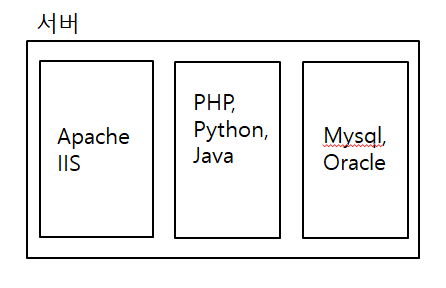

## PHP

## PHP란 무엇인가?

- 주로 HTML 코드를 프로그래밍적으로 생성
- 서버쪽에서 실행되는 클라이언트 언어
- Personal Home Page Tools의 약자에서 PHP: Hypertext Preprocessor로 의미가 변경되었다.

### 서버와 클라이언트



- 서버 : 정보를 제공하거나 요청에 대해서 응답

- 클라이언트 : 무언가를 요청하는 사람

- 웹브라우저=web client
  > 반대로 서버에 웹서버가 있을 것이라는 추정을 할 수 있다.

웹브라우저의 검색창에 url,domain 등등을 입력하고 검색하기를 누르면 서버컴퓨터가 위치하고 있는 주소로 가서 '웹서버'라고 하는 소프트웨어에게 요청을 하게 된다.

이 웹서버가 하는 일은 웹브라우저가 어떠한 특정한 페이지를 보여달라고 요청을 하게되면 그 요청에 의해서 응답하는 것이 웹서버가 하는 일이다.

web client의 구체적인 제품에는 파이어폭스,크롬,ie,사파리 등등이 있다.

웹서버의 구체적인 제품에는 아파치,IIS,nginx이 있다.

초창기의 인터넷에는 클라이언트가 요청을 하게되면 웹서버는 자기 컴퓨터에 저장되어 있는 HTML문서그대로 읽어와서 인터넷을 통해서 응답하는 것이 기본적인 웹의 초창기 모습이었다.

정적인 웹페이지를 벗어나기 위해 개발자들이 고안해낸 것이 CGI(Common Gateway Interface)인데, CGI를 사용함으로써 사용자가 요청한 것이 php문서라고 한다면 웹서버는 php엔진을 호출해서 사용자가 요청한 예를들어 topic.php파일을 의뢰를 한다. php엔진은 php파일의 문법에 따라 해석을 하고 그 결과를 웹서버에게 돌려준다. 그렇게해서 웹서버는 웹클라이언트에게 마치 html파일인 것처럼 전송하게 된다.

> CGI란? 서버와 외부스크립트 또는 프로그램가 상호작용할 때 이루어지면 입출력을 정의한 표준

### PHP의 특성

PHP : Hypertext(=HTML) Preprocessor(=전처리)
문서와 문서가 링크로 연결되어있다.

### PHP의 장점

- 웹에 최적화된 언어
- 웹개발에 필요한 수많은 로직들이 함수의 형태로 미리 제공됨
- 크로스플랫폼
- 거의 모든 데이터베이스를 지원
- 가장 많은 공개소프트웨어가 php로 만들어짐

### PHP 정보를 얻을 수 있는 곳

- [php공식홈페이지](http://php.net/)
- [국내최대의 php커뮤니티](http://phpschool.com/)

### PHP로 만들어진 솔루션들

- http://www.phpbb.com/
- http://www.phpmyadmin.net/home_page/index.php
- http://wordpress.com/
- http://www.xpressengine.com/
- http://www.textcube.org/

## 첫번째 PHP 에플리케이션


D:\Program_Files\wampstack\apache2\htdocs\firstapp경로의 helloworld.php실행

```
<?php
echo "Hello world";
?>
```

helloworld2.php실행

```
<html>
<body>
echo "Hello world";
<?php
echo "Hello world";
?>
</body>
</html>
```

## 서버측 언어를 사용하는 이유


초창기 웹서버와 웹브라우저를 고안한 사람이 팀버너스리 경이다.
초창기에는 웹서버와 웹브라우저로 이루어져 있던 단순한 구조였다. 웹사이트가 점점 성장하게 되면서 웹사이트에 있는 무수한 사용자들이 보게되고, 방문한 사람들이 직접 메세지를 작성한 것을 사이트에 전송해서 그 메세지가 다른사람들에 의해 열람될 수 있도록 하니까 이러한 것들을 웹서버만으로 처리하지 못하게 된다. 그래서 엔지니어들이 이러한 문제를 해결하기 위해서 고안된 것이 CGI이다.

http 란 웹브라우저와 웹서버가 서로 데이터를 주고받기 위한 통신규약
CGI란 웹서버와 서버사이드스크립트(php,py,java ...)가 서로 데이터를 주고받기 위한 통신규약

CGI를 거쳐가면서 서버사이드스크립트를 웹서버가 웹클라이언트에게 마치 html파일인 것처럼 전송하게 된다.

DB,Mysql,Oracle데이터베이스는 데이터를 저장하는 것에 특화되어 있는데 어떠한 블로그에 있는 포스팅의 제목,본문,댓글에 있는 정보들이 데이터베이스에 저장이 되어있다가 사용자가 어떤 웹페이지를 요청하게 되면 웹서버는 이 웹서버를 처리할 수 있는 언어에게 위임하게 되고 이 언어는 언어로 작성되어 있는 코드를 해석해서 웹서버로 돌려보내게 되는데 그 과정에서 데이터베이스에 있는 본문,제목,댓글과 같은 데이터를 사용하는 코드가 들어있다면 php,java,py언어들이 이 데이터베이스에 접속해서 이러한 정보들을 가져온 다음에 이 정보들을 html문서로 만든다음에 다시 웹서버로 돌려보낸다.
